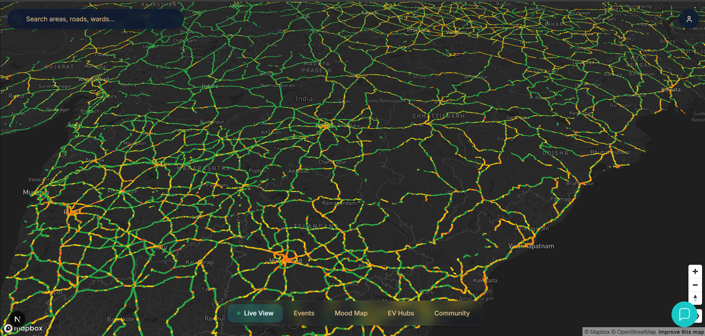
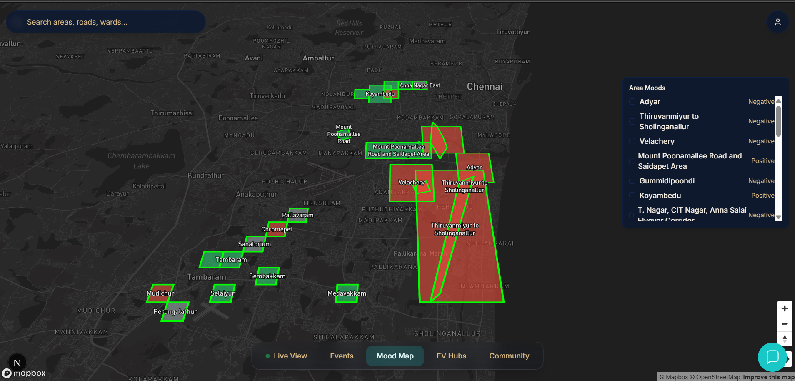
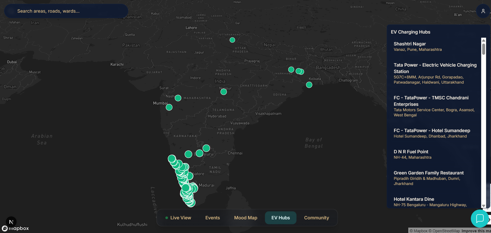
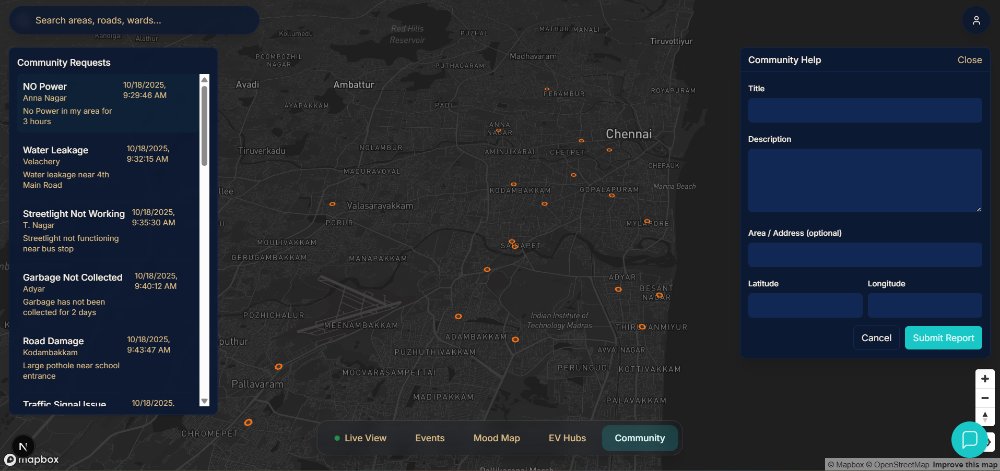
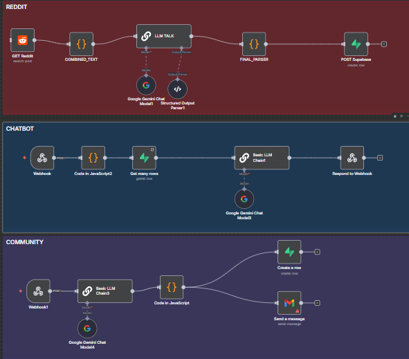

# City One — AI-Powered City Pulse Platform  

**Hackathon Project by Team MR.Robots**  
_An intelligent real-time urban insight platform powered by AI and automation._

---

## Overview

City One is an AI-powered urban intelligence platform that provides citizens with a live, unified, and predictive view of their city.  
It aggregates data from traffic APIs, social media sentiment, EV hub status, and community reports to deliver actionable insights that enhance mobility, awareness, and civic engagement.

---

## Problem Statement

Urban data is vast yet fragmented—spread across sensors, social media, and civic platforms—making it difficult for citizens to act on.  
City One integrates and filters this data through AI-based clustering and NLP, presenting real-time, reliable, and predictive insights in one interactive dashboard.

---

## Key Features

- **Real-Time Traffic Insights:** Visualizes congestion using live data and provides chatbot explanations for anomalies.  
- **City Sentiment Analysis:** Fetches social media data via n8n, processes it with Gemini AI, and displays sentiment heatmaps.  
- **EV Hub Monitoring:** Shows live EV charging station statuses across India.  
- **AI Chatbot (CityPulse AI):** Answers user queries using n8n Webhooks and Gemini AI.  
- **Community Help Reports:** Enables users to raise local issues, automatically acknowledged via AI-generated messages.  
- **Event Insights:** Displays live and upcoming events with sentiment-based crowd insights.

---

## Tech Stack

| Layer | Technology |
|--------|-------------|
| Frontend | Next.js + Mapbox GL JS |
| Backend | n8n Workflows |
| Database | Supabase |
| AI/ML | Gemini AI + NLP |
| Hosting | Vercel / Netlify |

---

## System Workflow

1. **Social Media Sentiment Flow:** n8n fetches Reddit/Twitter data → Gemini AI classifies sentiment → Stored in Supabase → Visualized as polygons on the map.  
2. **Chatbot Flow:** User query → n8n Webhook → Gemini AI response → Displayed in chat interface.  
3. **Community Help Flow:** User submits issue → Stored in Supabase → AI auto-response sent.

---

## Team MR.Robots

| Name | Role | Contribution |
|------|------|---------------|
| Lakshwin Krishna Reddy M | AI & Backend Automation | n8n workflows, Gemini integration, Supabase schema |
| Mohamed Saif MS | Frontend Developer | Next.js + Mapbox dashboard, visualization |
| Prathik E | Data Engineer | API integration, traffic data ingestion |
| Arunkumar P | UI/UX Designer | Dashboard layout, user experience |

---

## Future Scope
- Real-time crowd estimation via image analysis.  
- Adaptive traffic signal recommendations.  
- Event prediction using LLMs.  
- Cross-platform mobile version.

---

---

## 📸 Project Snapshots

###  Dashboard Overview

### 💬 Live City Sentiment

### ⚡ EV Hub Status

### 🧭 Community Reports

### ⚙️ n8n Automation Flow

---

## Conclusion

City One combines AI, automation, and citizen collaboration to create a responsive, intelligent city platform.  
It empowers users to navigate urban life smarter—turning complex city data into clear, real-time insights.
